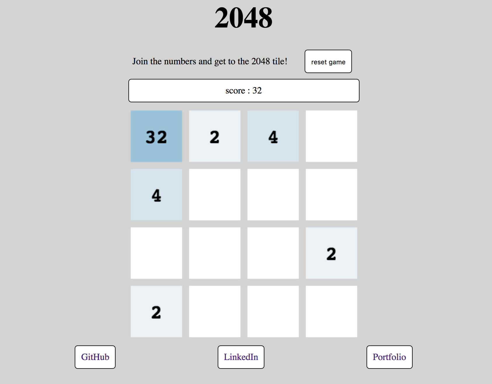

## 2048
---
A single-player sliding block puzzle game clone. User is supposed to press the left, right, up, and down arrow keys to move all the squares. Try to join the numbers and get to the 2048 tile!

## Feature
---
* score changing
* square moving
* square color will change with square value
